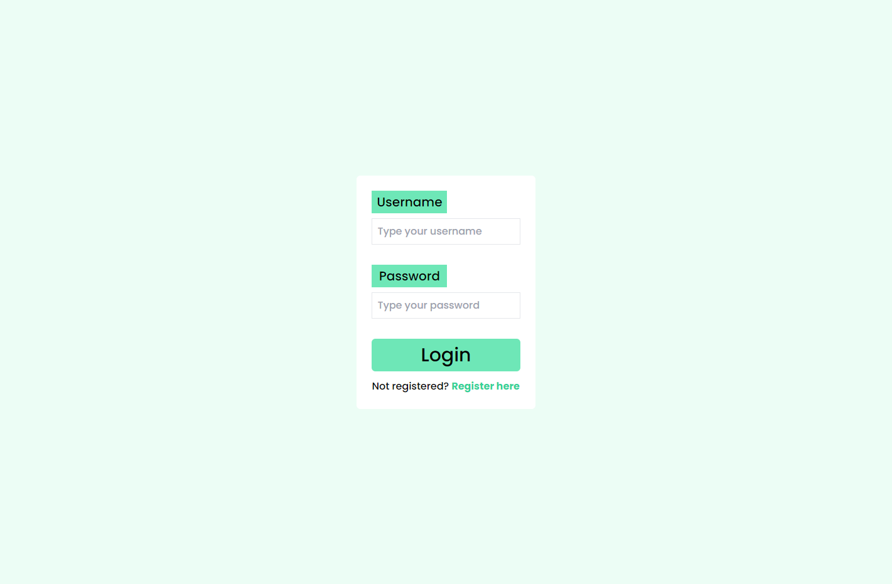
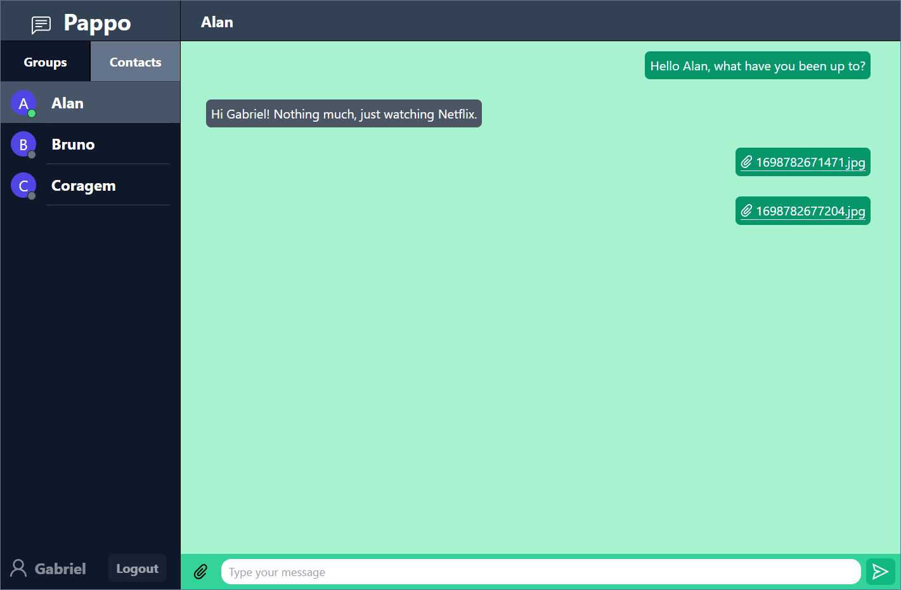

# Chat-app - Pappo

## 🚀 Technologies

These project was developd with the following thecnologies:

- HTML
- Tailwind CSS
- Typescrirpt
- Git and Github
- React
- Next Js
- Node
- Express
- MongoDB
- Mongoose
- Websockets
- JWT

## 💻 Project

This is a personal project that aims to create a chat app, with real time communication via websockets, using mongoDB as a database for storing messages, users and files, jwt for authentication, React and Nextjs as the frontend, Node, Express for the backend and Tailwind for the CSS

</img>

</img>
